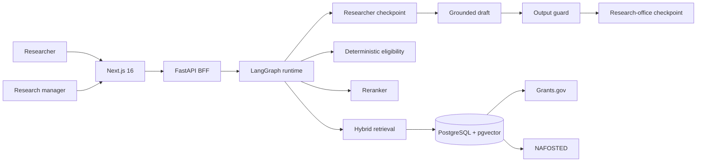
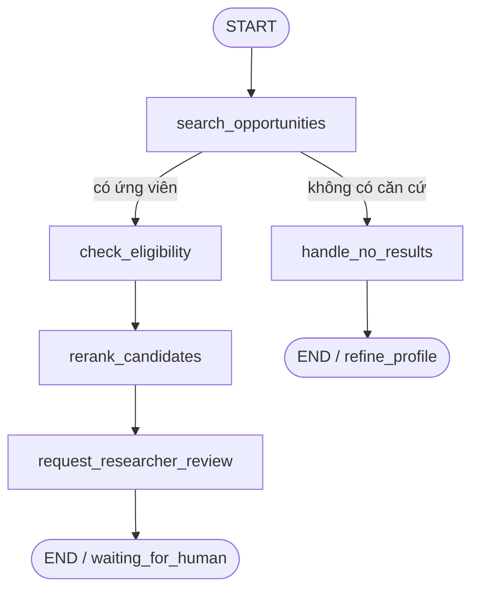
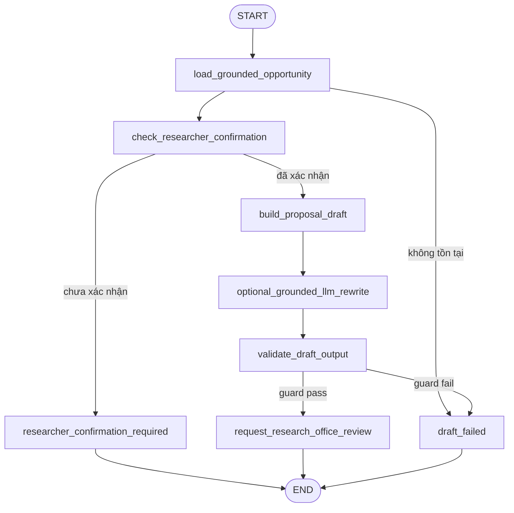

# Architecture — GrantFinder AI

## System overview

## Match graph

## Draft graph

## State và persistence

- Mỗi run có `thread_id`, checkpoint và tool trace.
- Local/test dùng `InMemorySaver`.
- Production đặt `LANGGRAPH_CHECKPOINT_BACKEND=postgres`; `PostgresSaver` dùng cùng PostgreSQL với pgvector.
- Serializer chỉ cho phép các model nội bộ đã khai báo và bật `LANGGRAPH_STRICT_MSGPACK=true`.

## Ranh giới trách nhiệm

| Thành phần | Chịu trách nhiệm |
|---|---|
| Next.js | Nhập hồ sơ, hiển thị shortlist, citation, trace và cổng duyệt |
| FastAPI | Validation, role gate, API contract, lỗi HTTP |
| LangGraph | State, nodes, conditional routing, checkpoint, trace |
| PostgreSQL/pgvector | Hard fields, JSON gốc, full-text và vector search |
| Deterministic rules | Deadline, budget ceiling, applicant type, eligibility sơ bộ |
| LLM tùy chọn | Viết lại draft trong context đã khóa; không quyết định hard facts |
